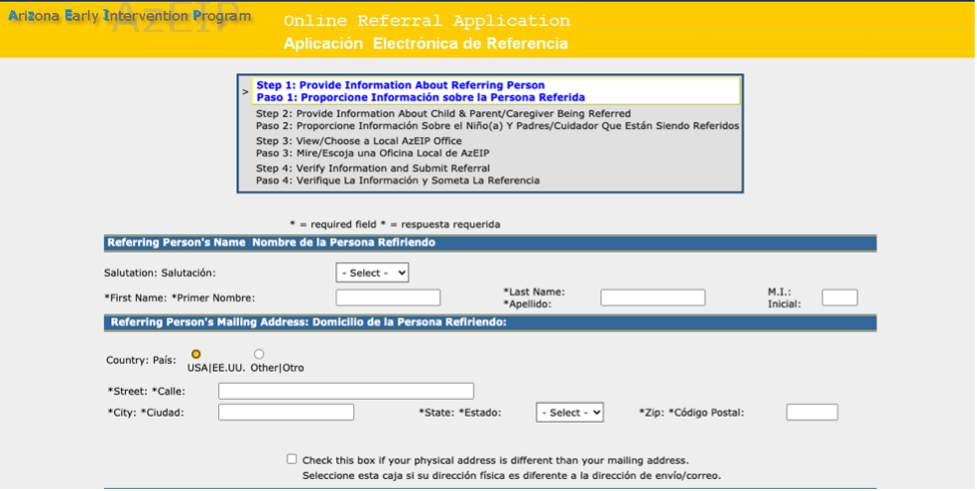

# Bridging the Gap between Government Services and Families in Need
Yutong Feng | DH110 | Fall 2021

## Assignment01: Heuristic Evaluation

### Project description:
During the COVID19 pandemic, many families have been struggling due to financial difficulties, plagued with medical bills and risk of unemployment. Through a brief navigation of the Arizona State Government websites, I found that help and resources are too hard to find. Online services and applications are already limited enough; when hidden in menu options or designed in hidden corners where users will likely not see, the design blocks families from the assistance that they need and deserve. For this class, I would be interested in creating a portal for families, where all government documents, applications, services, and benefits can be managed in one space. 

### Severity Ratings in Heuristic Evaluation by [Nielson Norman Group](https://www.nngroup.com/articles/how-to-rate-the-severity-of-usability-problems/)  
| Rating | Description |
|---|---|
| 1 | Cosmetic problem only: need not be fixed unless extra time is available on project |
| 2 | Minor usability problem: fixing this should be given low priority |
| 3 | Major usability problem: important to fix, so should be given high priority |

### Heuristic Evaluation Principles by [Nielson Norman Group](https://www.nngroup.com/articles/ten-usability-heuristics/)
| Number | Heuristic | Questions to Ask |
|---|---|---|
| #1 | Visibility of system status | Is the user informed about what is going on? Are there appropriate feedback?
| #2 | Match between system of the real world | Is it speaking users’ languages and mental models? Is it intuitive? 
| #3 | User control and freedom | Is undo and redo supported? Are users stuck without a clear exit? 
| #4 | Consistency and standards | Is the product using consistency vocabulary and visuals? Is the product consistent with the industry standard?
| #5 | Error Prevention | Are high-cost errors prevented? Are error-prone conditions eliminated or warned for?
| #6 | Recognition rather than recall | Are information and help visible and easily retrievable? Can users rely on recognition to complete tasks?
| #7 | Flexibility and efficiency of use | Are there shortcuts to completing the task? Is there room for personalization?
| #8 | Aesthetic and minimalistic design | Are all content essential or are there too many visual noises? Are primary features prioritized with visual hierarchy? 
| #9 | Help users recognize, diagnose, and recover from errors | Are error messages clear in indicating the problem in a language users can understand? Are solutions offered?
| #10 | Help and documentation | Can help be easily found? Are documentation and steps to completion presented at the required contexts? 

## Website 1: [Arizona Early Intervention Program](https://des.az.gov/services/disabilities/developmental-infant) 
### Description: 
Arizona Early Intervention Program is a statewide interagency system of services for families of infants and toddlers with disabilities or delays. Through this website, potentially eligible families can apply for the early intervention services through a family survey, while other family members, professionals, or friends/neighbors can refer children and families to the service through an online referral application system. 

### Why I chose this website:
This website aligns with my interest in creating products that will help provide services and support for families with special needs. Like most government websites, it carries a huge information burden to explain their program mission and introduce their service to different targeted audiences, while ensuing paths to each actionable item (e.g., survey, referral, etc). The way information is structured, contained, and addressed to different parties on this website will be a reference for my final project. 

### Overall Evaluation:
The website is hard to navigate and needs major improvements in terms of information structure, visual design, and interactivity. I am overwhelmed by the amount of information and visual elements clustered on the landing page. The page feels visually burdening with all the strong blues from header to footer to the abundant list of links. Key actionable items are hard to decipher from other information clutter. Overall, I would say the user experience on this website is lacking and confusing. 

### Heuristic Evaluation
#### #1 Visibility of System Status

**Good**: The system shows the user their current status by highlighting their state on the top of the survey (step1) and by expliciting labelling the organizational order of many nested menu options that result in this final web page. These visual feedback communicate clearly to the users where they are.

**Bad**: This search bar does not respond to the users typing as options are not immediately displayed as is with the industry standard. This can confuse the user – they may think that the search bar does not work or that the website does not have the information they are desiring.
**Severity**: 2
**Recommendation**: Display results as the user is typing; this way users can receive immediate feedback that engages them to continue to trust and explore the website.

