# Bridging the Gap between Government Services and Families in Need
Yutong Feng | DH110 | Fall 2021

## Assignment01: Heuristic Evaluation

### Project description:
During the COVID19 pandemic, many families have been struggling due to financial difficulties, plagued with medical bills and risk of unemployment. Through a brief navigation of the Arizona State Government websites, I found that help and resources are too hard to find. Online services and applications are already limited enough; when hidden in menu options or designed in hidden corners where users will likely not see, the design blocks families from the assistance that they need and deserve. For this class, I would be interested in creating a portal for families, where all government documents, applications, services, and benefits can be managed in one space. 

### Severity Ratings in Heuristic Evaluation by [Nielson Norman Group](https://www.nngroup.com/articles/how-to-rate-the-severity-of-usability-problems/)  
| Rating | Description |
|---|---|
| 1 | Cosmetic problem only: need not be fixed unless extra time is available on project |
| 2 | Minor usability problem: fixing this should be given low priority |
| 3 | Major usability problem: important to fix, so should be given high priority |

### Heuristic Evaluation Principles by [Nielson Norman Group](https://www.nngroup.com/articles/ten-usability-heuristics/)
| Number | Heuristic | Questions to Ask |
|---|---|---|
| #1 | Visibility of system status | Is the user informed about what is going on? Are there appropriate feedback?
| #2 | Match between system of the real world | Is it speaking users’ languages and mental models? Is it intuitive? 
| #3 | User control and freedom | Is undo and redo supported? Are users stuck without a clear exit? 
| #4 | Consistency and standards | Is the product using consistency vocabulary and visuals? Is the product consistent with the industry standard?
| #5 | Error Prevention | Are high-cost errors prevented? Are error-prone conditions eliminated or warned for?
| #6 | Recognition rather than recall | Are information and help visible and easily retrievable? Can users rely on recognition to complete tasks?
| #7 | Flexibility and efficiency of use | Are there shortcuts to completing the task? Is there room for personalization?
| #8 | Aesthetic and minimalistic design | Are all content essential or are there too many visual noises? Are primary features prioritized with visual hierarchy? 
| #9 | Help users recognize, diagnose, and recover from errors | Are error messages clear in indicating the problem in a language users can understand? Are solutions offered?
| #10 | Help and documentation | Can help be easily found? Are documentation and steps to completion presented at the required contexts? 

## Website 1: [Arizona Early Intervention Program](https://des.az.gov/services/disabilities/developmental-infant) 
### Description: 
Arizona Early Intervention Program is a statewide interagency system of services for families of infants and toddlers with disabilities or delays. Through this website, potentially eligible families can apply for the early intervention services through a family survey, while other family members, professionals, or friends/neighbors can refer children and families to the service through an online referral application system. 

### Why I chose this website:
This website aligns with my interest in creating products that will help provide services and support for families with special needs. Like most government websites, it carries a huge information burden to explain their program mission and introduce their service to different targeted audiences, while ensuing paths to each actionable item (e.g., survey, referral, etc). The way information is structured, contained, and addressed to different parties on this website will be a reference for my final project. 

### Overall Evaluation:
The website is hard to navigate and needs major improvements in terms of information structure, visual design, and interactivity. I am overwhelmed by the amount of information and visual elements clustered on the landing page. The page feels visually burdening with all the strong blues from header to footer to the abundant list of links. Key actionable items are hard to decipher from other information clutter. Overall, I would say the user experience on this website is lacking and confusing. 

### Heuristic Evaluation
### #1 Visibility of System Status

* **Good**: The system shows the user their current status by highlighting their state on the top of the survey (step1) and by expliciting labelling the organizational order of many nested menu options that result in this final web page. These visual feedback communicate clearly to the users where they are.

* **Bad**: This search bar does not respond to the users typing as options are not immediately displayed as is with the industry standard. This can confuse the user – they may think that the search bar does not work or that the website does not have the information they are desiring.

  * **Severity**: 2

  * **Recommendation**: Display results as the user is typing; this way users can receive immediate feedback that engages them to continue to trust and explore the website.

### #2 Match Between System and the Real World
 

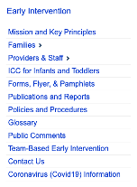
  
* **Good**: The menu options are written in the users' language. Topic words are intuitive, short, and avoids hard jargon.

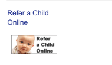

* **Bad**: This button, to one of the two most key actionable items through this website, is very confusing – it does not work the existing user mental models on what actionable buttons should look like. The icon and the header (which is in very similar color to clickable menu items right above it) repeat the same call-to-action, making it unintuitive which one is clickable, and which isn’t. When switching between the sidebar menu options, this icon may disappear for some pages and reappear for others. 

   * **Severity**: 3

  * **Recommendation**: Make it an actual button below without the visual noises of the pictures and fancy fonts. If the copy on the button is going to be the same as the header, deleting the header will eliminate the confusion. Let the icon stay in the same position for all pages (do not have it disappear and reappear).

### #3 User Control and Freedom

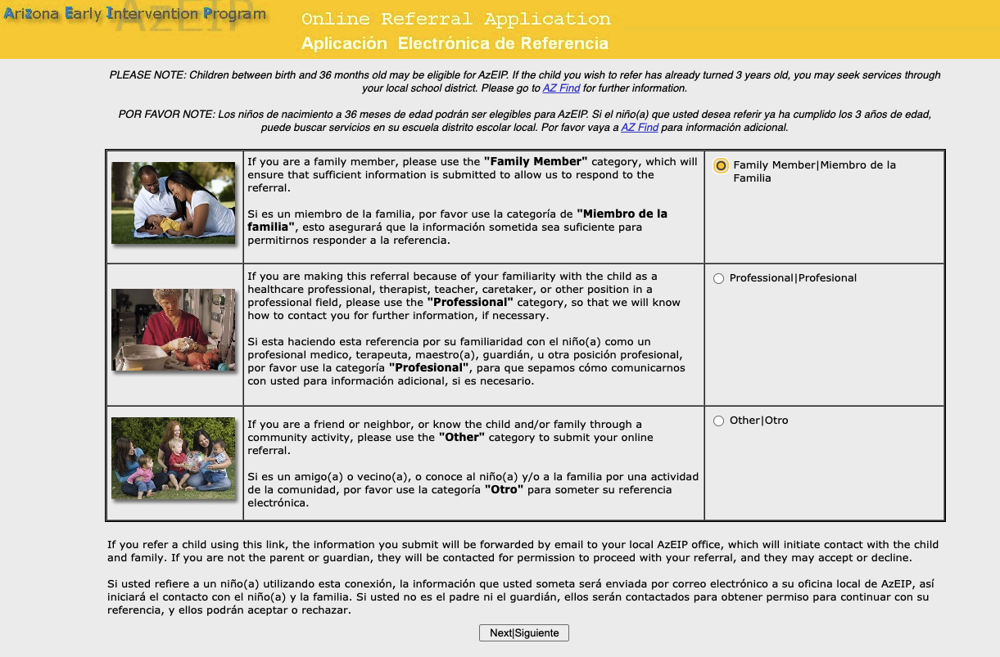
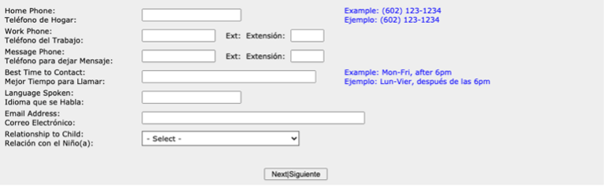

* **Bad**: The image on the left is the design of where users begin their referral application. There is only one button to move forward - the button at the end of the page that reads "Next". Similarily, the image on the right is when users are the middle of filling in their application. Here, there is also only one "Next" button. Users are not given the choice to go back to previous pages to check their information, nor are they given the choice to exit altogether. They have to rely on buttons of their browser to go back.  

 *  **Severity**: 3

 *  **Recommendation**: Add a cancel button at the starting page of the survey and add a back button as the users are progressing through the steps of the survey to ensure that users are not stuck. 

### #4 Consistency and Standards

* **Good**: All clickable links are consistently in blue and underlined by hovered. 

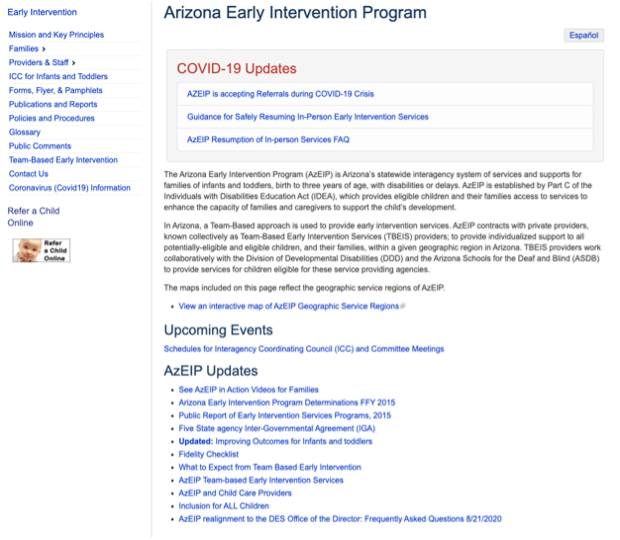
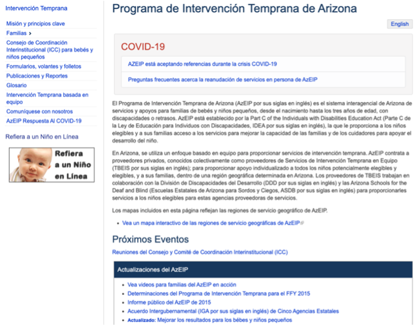

* **Bad**: The design of the website in terms of the call-to-action button and the information architecture is inconsistent between the two language versions. It has not achieved internal consistency. The two buttons are of different sizes, some jargons were explained in the Spanish version, and the “AzEIP Updates” sections are of two different styles. 

  * **Severity**: 2

  * **Recommendation**: Utilize the same content structure and visual style for both languages. 

### #5 Error Prevention

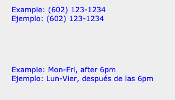
 
* **Bad**: Sample answers were given to help users avoid errors in their data-entry. However, this is very ineffective. 

  * **Severity**: 2

  * **Recommendation**: If there is a preferred format for the data-entry, only give users the tools to easily answer in the given format. For example, giving them a hover selector to choose available weekdays and another to choose the time. 

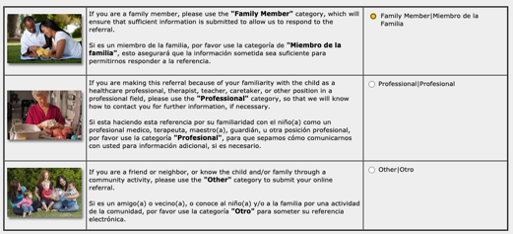

* **Bad**: Users can be overwhelmed by the amount of information on this page where they are expected to make a choice between 3 identity categories. This problem is exacerbated when the table is filled with paragraphs of both languages. This creates an error-prone condition because if users made the wrong choice, they would continue into the survey in the wrong standpoint only to find themselves having to go back and redo it all. 

  * **Severity**: 2

  * **Recommendation**: Change the information structure: this could be redesigend as an easy multiple choice question. Offer the users the language choice instead of writing all the content in two languages. To avoid errors, an additional pop-up window that asks the user to reconfirm their role can be added. 

 
* **Bad**: The survey does not save the users answers. 

  * **Severity**: 2

  * **Recommendation**: Save the users answers and tell the user you are saving their answers (through a pop-up window or a saving/saved icon that indicates the status of their draft).  

### #6 Recognition rather than Recall
* **Good**: Glossary is one of the sidebar menu options; users can seek help to understand certain medical/professional terms. This is as expected with government websites that should prioritize easy wording of hard concepts to ensure users’ content comprehension. 

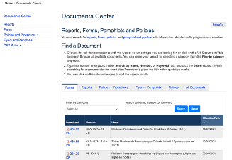

* **Bad**: The organizational structure of the website has flaws that force the user to remember their navigation history. Clicking through the menu option will at times bring the user to a completely different “area” of the web where they can only click “go back” on their browser to return to the original page. For example, clicking Forms, Flyers, & Pamphlets brings the user to the general Document Center, where users will have to recall what kind of information they needed for their application or were most interested in the search bar. 

  * **Severity**: 3

  * **Recommendation**: The Forms, Flyers, & Pamphlets tab should directly provide users the forms required for this specific AzEIP program and information directly related to this topic. A general document center database can be linked at the end of the page as additional resources; however, we cannot expect users know and remember exactly what they need. 

 
### #7 Flexibility and Efficiency of Use

* **Good**: Users can personalize the website to the language they prefer, choosing between English and Spanish options. 

* **Bad**: There is not shortcut to completing tasks, nor are there clear call-to-action buttons to which users can engage in immediately after arriving on the website. 

  * **Severity**: 3

  * **Recommendation**: Create clear call-to-action buttons to help initiate referrals and family survey behavior, instead of hiding them in layers of menu options or placing them out in inconsistent patterns. 

### #8 Aesthetic and Minimalistic Design

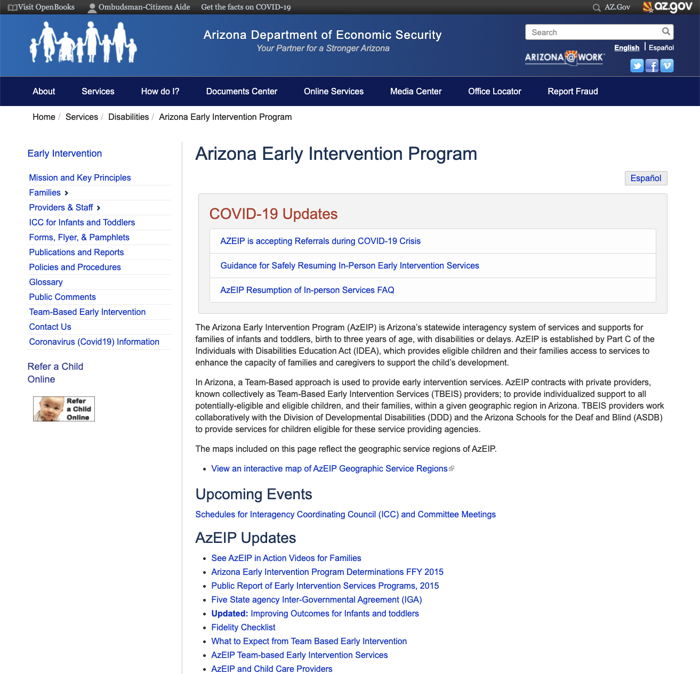
 
* **Bad**: The pages are overwhelming. There is no way to identify primary features of this website, and only after exploring all the menu options, do we understand the key actionable items that can be achieved. When filling in the online referral application, not only did the stark contrast between blues and yellows cause discomfort, but it is also simply unreadable. The fonts families and sizes were awfully chosen to be very unreadable as long lines of English and Spanish texts are clustered together, causing the sense of bulkiness.

  * **Severity**: 3
 
  * **Recommendation**: Highlight call-to-action icons, utilize typography with high readability, create clean UI design by eliminating clustering of information and texts (separating into English and Spanish versions), and adjusting the colors to avoid visual burden. 

 ### #9 Help users recognize, diagnose, and recover from errors

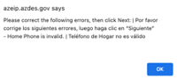
 
* **Bad**: The error message can be clearer, and solutions are lacking. Instead of saying invalid, can the system tell that the phone number is not in the right format? Can it suggest the next step? Can it bring the users eyes to their next step? 

  * **Severity**: 2

  * **Recommendations**: Be more specific for the reason of this invalidation and suggest solutions to solve this problem. The textbox where the error occurs should be labelled or highlighted red for which users could then find the problem on the page and fix it immediately.

### #10 Help and Documentation

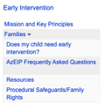

* **Bad**: There are no other help options other than Contact Us and FAQs. However, this FAQs page is hard to find at first glance as it is hidden in another menu option. 
  * **Severity**: 2
  * **Recommendation**: Make the FAQ a separate menu option. 
 
 
 
 

## Website 2: [Health-e-Arizona Plus Portal](https://www.healthearizonaplus.gov/Login/Default)
### Description: 
The Health-e-Arizona Plus Portal is an online application for Arizona Residents. It connects individuals and families to coverage, benefits, and services such as nutrition benefits, medical coverage, and cash assistance. Here, applicants can submit applications, view receipts, renew, and manage benefits. There are 3 main user groups: individuals and families (main applicants), state workers (staff), and community assistors (who help applicants with their application). 

### Why I chose this website:
I am interested in evaluating this website because it is a straightforward portal that connects families to many government services. The functionality and interactivity of this web-app may inspire the details of my project and how I want to create a space where families can perfume all needed government actions, whether that be paying taxes, applying for benefits, or signing up for programs.  

### Overall Evaluation:
The website is extremely colorful, and again visually overwhelming. The portal offers a range of services that is organized in a grid/card format for new applicants and applicants with existing accounts. The interlinkage between these services is not very intuitive; there are better ways to design the user experience by creating clearer interactions and slowly progressing the user to their desired service rather than throwing everything into their plate. 

### Heuristic Evaluation
 
### #1 Visibility of System Status

* **Good**: The system shows the user their current status by highlighting their state on the top of the survey (step1) and by expliciting labelling the organizational order of many nested menu options that result in this final web page. These visual feedback communicate clearly to the users where they are.

* **Bad**: This search bar does not respond to the users typing as options are not immediately displayed as is with the industry standard. This can confuse the user – they may think that the search bar does not work or that the website does not have the information they are desiring.

  * **Severity**: 2

  * **Recommendation**: Display results as the user is typing; this way users can receive immediate feedback that engages them to continue to trust and explore the website.

### #2 Match Between System and the Real World
 

  
* **Good**: The menu options are written in the users' language. Topic words are intuitive, short, and avoids hard jargon.

* **Bad**: This button, to one of the two most key actionable items through this website, is very confusing – it does not work the existing user mental models on what actionable buttons should look like. The icon and the header (which is in very similar color to clickable menu items right above it) repeat the same call-to-action, making it unintuitive which one is clickable, and which isn’t. When switching between the sidebar menu options, this icon may disappear for some pages and reappear for others. 

   * **Severity**: 3

  * **Recommendation**: Make it an actual button below without the visual noises of the pictures and fancy fonts. If the copy on the button is going to be the same as the header, deleting the header will eliminate the confusion. Let the icon stay in the same position for all pages (do not have it disappear and reappear).

### #3 User Control and Freedom

* **Bad**: The image on the left is the design of where users begin their referral application. There is only one button to move forward - the button at the end of the page that reads "Next". Similarily, the image on the right is when users are the middle of filling in their application. Here, there is also only one "Next" button. Users are not given the choice to go back to previous pages to check their information, nor are they given the choice to exit altogether. They have to rely on buttons of their browser to go back.  

 *  **Severity**: 3

 *  **Recommendation**: Add a cancel button at the starting page of the survey and add a back button as the users are progressing through the steps of the survey to ensure that users are not stuck. 

### #4 Consistency and Standards

* **Good**: All clickable links are consistently in blue and underlined by hovered. 

* **Bad**: The design of the website in terms of the call-to-action button and the information architecture is inconsistent between the two language versions. It has not achieved internal consistency. The two buttons are of different sizes, some jargons were explained in the Spanish version, and the “AzEIP Updates” sections are of two different styles. 

  * **Severity**: 2

  * **Recommendation**: Utilize the same content structure and visual style for both languages. 

### #5 Error Prevention

 
* **Bad**: Sample answers were given to help users avoid errors in their data-entry. However, this is very ineffective. 

  * **Severity**: 2

  * **Recommendation**: If there is a preferred format for the data-entry, only give users the tools to easily answer in the given format. For example, giving them a hover selector to choose available weekdays and another to choose the time. 

* **Bad**: Users can be overwhelmed by the amount of information on this page where they are expected to make a choice between 3 identity categories. This problem is exacerbated when the table is filled with paragraphs of both languages. This creates an error-prone condition because if users made the wrong choice, they would continue into the survey in the wrong standpoint only to find themselves having to go back and redo it all. 

  * **Severity**: 2

  * **Recommendation**: Change the information structure: this could be redesigend as an easy multiple choice question. Offer the users the language choice instead of writing all the content in two languages. To avoid errors, an additional pop-up window that asks the user to reconfirm their role can be added. 

 
* **Bad**: The survey does not save the users answers. 

  * **Severity**: 2

  * **Recommendation**: Save the users answers and tell the user you are saving their answers (through a pop-up window or a saving/saved icon that indicates the status of their draft).  

### #6 Recognition rather than Recall
* **Good**: Glossary is one of the sidebar menu options; users can seek help to understand certain medical/professional terms. This is as expected with government websites that should prioritize easy wording of hard concepts to ensure users’ content comprehension. 

* **Bad**: The organizational structure of the website has flaws that force the user to remember their navigation history. Clicking through the menu option will at times bring the user to a completely different “area” of the web where they can only click “go back” on their browser to return to the original page. For example, clicking Forms, Flyers, & Pamphlets brings the user to the general Document Center, where users will have to recall what kind of information they needed for their application or were most interested in the search bar. 

  * **Severity**: 3

  * **Recommendation**: The Forms, Flyers, & Pamphlets tab should directly provide users the forms required for this specific AzEIP program and information directly related to this topic. A general document center database can be linked at the end of the page as additional resources; however, we cannot expect users know and remember exactly what they need. 

 
### #7 Flexibility and Efficiency of Use

* **Good**: Users can personalize the website to the language they prefer, choosing between English and Spanish options. 

* **Bad**: There is not shortcut to completing tasks, nor are there clear call-to-action buttons to which users can engage in immediately after arriving on the website. 

  * **Severity**: 3

  * **Recommendation**: Create clear call-to-action buttons to help initiate referrals and family survey behavior, instead of hiding them in layers of menu options or placing them out in inconsistent patterns. 

### #8 Aesthetic and Minimalistic Design

 
* **Bad**: The pages are overwhelming. There is no way to identify primary features of this website, and only after exploring all the menu options, do we understand the key actionable items that can be achieved. When filling in the online referral application, not only did the stark contrast between blues and yellows cause discomfort, but it is also simply unreadable. The fonts families and sizes were awfully chosen to be very unreadable as long lines of English and Spanish texts are clustered together, causing the sense of bulkiness.

  * **Severity**: 3
 
  * **Recommendation**: Highlight call-to-action icons, utilize typography with high readability, create clean UI design by eliminating clustering of information and texts (separating into English and Spanish versions), and adjusting the colors to avoid visual burden. 

 ### #9 Help users recognize, diagnose, and recover from errors

 
* **Bad**: The error message can be clearer, and solutions are lacking. Instead of saying invalid, can the system tell that the phone number is not in the right format? Can it suggest the next step? Can it bring the users eyes to their next step? 

  * **Severity**: 2

  * **Recommendations**: Be more specific for the reason of this invalidation and suggest solutions to solve this problem. The textbox where the error occurs should be labelled or highlighted red for which users could then find the problem on the page and fix it immediately.

### #10 Help and Documentation

* **Bad**: There are no other help options other than Contact Us and FAQs. However, this FAQs page is hard to find at first glance as it is hidden in another menu option. 
  * **Severity**: 2
  * **Recommendation**: Make the FAQ a separate menu option. 
 

