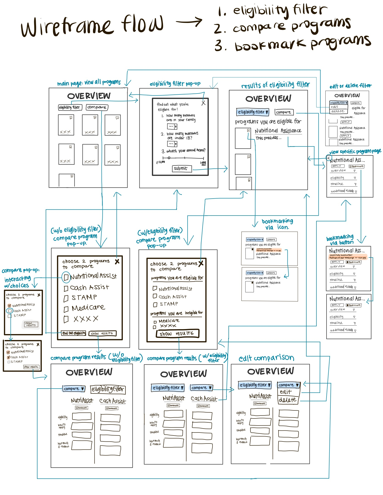
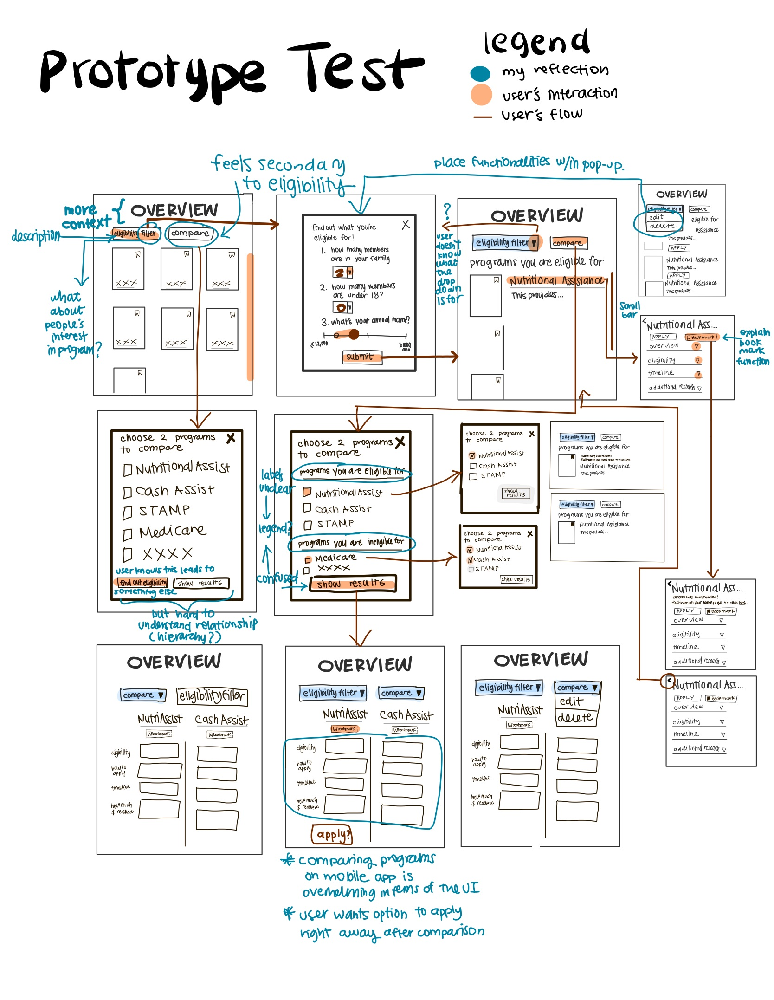

# Assignment 04: Persona

#### Yutong Feng | DH110 Fall 2021 | Nov 2. 2021

### Purpose of Low-Fidelity Prototyping
Low-fidelity prototyping is designed to visualize and test the structural contents and workflows before fully investing into a high-fidelity, high-cost design and development of the product. The way low-cost paper prototypes are easy to create, edit, shuffle, and test allows designers to get feedback from users and iterate the workflows to best fit the users' mental models. In the process of creating this prototyping, I've identified 3 key tasks that users should be able to perform with this product, but also refined the interactions they were going to have. Not only did this help me invision the final outcome of my product by designing the brief structural functionalities, but I was also able to test these features and receive valuable feedback from my users on whether or not my initial intentions and assumptions were aligning with the experience of the user's. This will inform my copy-writing, interface structure, interaction design, and the reworking of my user flow to create the high-fidelity prototype.

### Tasks and Features to Support
1. Eligibility Filter
2. Compare Programs
3. Bookmark Programs

### Wireframes and Wireflow

### Prototype Testing

  

### User Feedback

### Reflection

