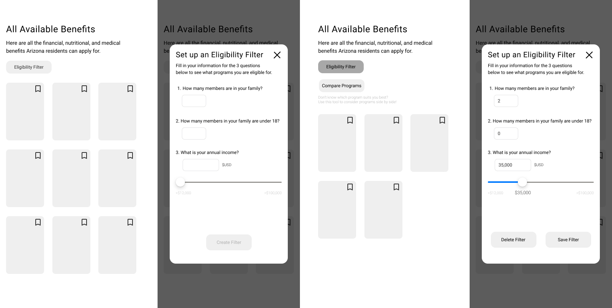

# Assignment 05: Low-fidelity Prototyping

#### Yutong Feng | DH110 Fall 2021 | Nov 2. 2021

### Purpose of Low-Fidelity Prototyping
Low-fidelity prototyping is designed to visualize and test the structural contents and workflows before fully investing into a high-fidelity, high-cost design and development of the product. The way low-cost paper prototypes are easy to create, edit, shuffle, and test allows designers to get feedback from users and iterate the workflows to best fit the users' mental models. In the process of creating this prototyping, I've identified 3 key tasks that users should be able to perform with this product, but also refined the interactions they were going to have. Not only did this help me invision the final outcome of my product by designing the brief structural functionalities, but I was also able to test these features and receive valuable feedback from my users on whether or not my initial intentions and assumptions were aligning with the experience of the user's. This will inform my copy-writing, interface structure, interaction design, and the reworking of my user flow to create the high-fidelity prototype.

### Tasks and Features to Support
1. Eligibility Filter
2. Compare Programs
3. Bookmark Programs

### Wireframes and Wireflow

### Prototype Testing

  

### User Feedback
1. The user validates the MVP flow of the eligibility filter. "I think this eligibility filter skips a lot of work for me to do the browsing on my own. This is really valuable as it saves so much of my time and energy - as I remember how troubled I were on the website before." The user worked from eligiblity filter - filling in information - submitting filter - choosing to view one program in detail - and straight to "apply". 
  
2. The user views "compare program" feature secondary to the eligibility filter and was profoundly confused with the flow where the compare programs came first (when presented to him after he completed in MVP flow). 
  
3. The user was confused at the drop-down functionality of the "eligibility filter" button and the "compare programs" button. They did not understand why actions such as editing or deleting the filter would be placed under a drop-down. 
  
4. Copy such as "show results" or the information structure that divided "programs you are eligible for" and "programs you are ineligible for" on the pop-up window needed clearer visual execution. 
  
5. The results of compare programs is overwhelming. The user also wonders where the "apply" button is after reading these programs' similarities and differences. 

### Reflection
This prototyping test was performed with the user who did the usability testing of the Health-e-Arizona portal website. The prototyping test was not as easy as I imagined. I often felt frustrated when the user didn't understand what a certain design meant or chose to ignore a button I thought was essential on the page. It was testing my soft skills as an UX researcher but I'm glad I learnt how to keep a straight-face, be encouraging, and let the user explore during this experience. 
  
The user was very knowledgable of this topic and offered a lot of insights that are now informing my design of the hi-fi prototype. Many of his feedback made me realize the points I've failed to consider before going straight into the wireframing process, such as the very fact that creating a clearer hierarchy of the features may be needed to highlight the MVP (i.e., eligibility filter). Placing these features with different visual importance not only gives user useful tools to achieve their goals efficiently, but the step-by-step presentation of features in the order from most-value to less-value will prevent the system from confusing the users with too much unwanted freedom (thus loss of directionality) on an already overwhelming page of information.
  
From the results of this prototype testing, I am satisfied that the MVP flow is well-aligned with the user's point of view. Nonetheless, I have a list of areas I need to edit on these wireframes: 
1. Clearer copy on main actionable buttons. 
2. Create hierarchy of features - with the "compare program" option" only available after user has added the eligibility filter
3. Develop ways where the system can explain what these feature mean and what actions the users are able to achieve with it
4. Look into ways to better present lots of information on a mobile app (i.e., the compare program results is overwhelming for a small screen size). 

#### After the test
I made a few changes to the first few lo-fi wireframes of the MVP flow and transferred them onto Figma to present to the user some visual reflection to his feedback. I began by establishing a certain functional hierarchy, such that "compare" (of lower-value to the user) only comes after the user has established their "eligibility filter" (of higher-value to the user). 

  

This flow captures: 
1) user land on main page to see overview of all programs and clicks the eligibility filter button, 
2) eligibility filter pop-up window allows users to fill in their information (this wireframe highlights how the "create filter" button is disabled before any data entry), 
3) after setting up the filter, users are offered a button to "compare programs" - and just in case users have no idea what that means, a short description in grey below explains why this is offered
4) users can go back and edit their eligibility filters in the same pop-up window (instead of interacting the the drop-down menu of the button in earlier iterations that only confused the user). 
  

 
  

