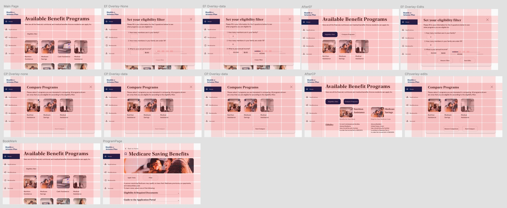
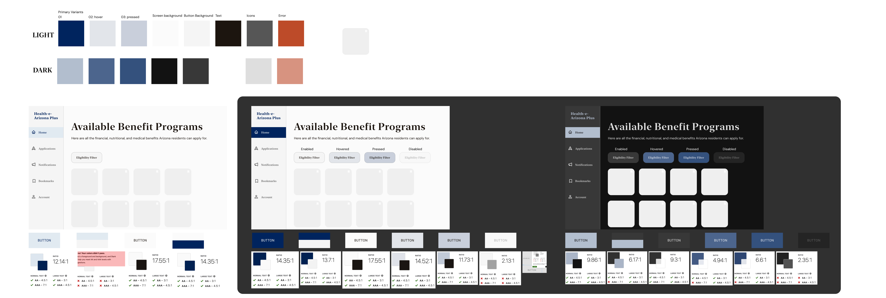
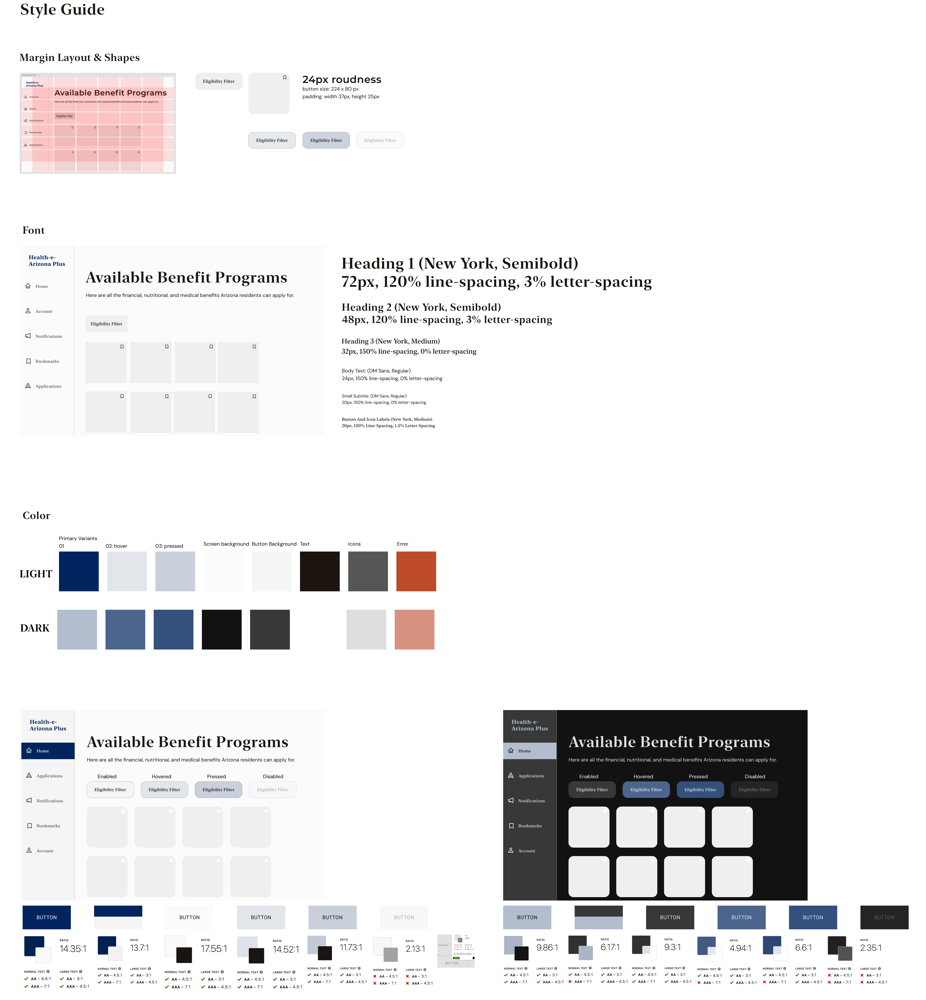

# Assignment 06: Interface Design

#### Yutong Feng | DH110 Fall 2021 | Nov 9. 2021

## Project Brief and Key Tasks
In hopes to improve the Health-e-Arizona-plus Portal that allows Arizona residents to apply and manage their benefits, I designed this interactive prototype to solve the current usability problems and match with user insights. The key tasks, validated by user research and extensive journey mapping of personas, are 
1) able to select programs only based on your elibility - Elibility Filter, 
2) able to compare and contrast programs at a glance - Compare Programs, 
3) able to mark programs to view for later - Bookmark. 

Instead of experiencing the confusing workflow between the Arizona Economic Security Website and Health-e-Arizona-Plus portal, users will be able to not only apply for these applications but be informed of what each benefit entails on one website. Users will be able to select the information they are most interested in, view these information in a time-efficient, focused manner, and to be able to save and reaccess this information anytime. 

### Purpose
The purpose of this interactive prototype is to visualize the task flow for the 3 of these key features, to create a consistent design library for future designs, to establish visual skeletons and basic forms/concepts of interactions, and to serve as a tool for usability testing to validate our solutions.  

### Process
This interactive prototype is the digitalized and high-fidelity version of the paper prototype. It was created using Figma. After digitalizing the paper wireframes, I transferred the small frames to the scale of a website (utilizing the standard 1440 x 900px MacBook Pro screen size). After the information has been transferred, I began by implementing a grid to determine the best information structure. Then, I determined the typography styles of all texts, which would then inform the shapes and sizes of the buttons and cards. After completing all the structural parts of the grey-scale wireframes through several rounds of iterations, I developed a color scheme (accomodating for both light and dark themes) that would be fitting for the intention of this website (a "Arizona" "Government" website) and all the states of interaction (e.g., hovering, pressing, disabled). 

## Interface
[Interactive Prototype](https://www.figma.com/proto/JSKqJ6KhHVMF8IhV1pzBKE/DH110-A06?page-id=0%3A1&node-id=30%3A3956&viewport=241%2C48%2C0.07&scaling=contain&starting-point-node-id=30%3A3956)

[Wireflow Design File](https://www.figma.com/file/JSKqJ6KhHVMF8IhV1pzBKE/DH110-A06?node-id=30%3A3956)

### Design Iterations
The Process of Iterating was fun as I got to create many versions of the same screen to find a style that was best fit for the intentions of this prototype.

#### Layout
Creating the layout on Figma was essential because web designs depend heavily on control of spacing and overall information architecture. I created of 6 rows and 6 columns with gutters of 12px and margins of 100px on each side. I organized the information according to this layout grid as show below.

#### Typography
I explored the typography according to families of serifs and san-serifs. I wanted a more modern touch to the typography that would not sacrifice the trustworthiness or legimacy of the website. After a few iterations with different font families, I decided on New York and DM Sans as the two key font families. For the font sizes for heading and body texts, I referred to the ratio recommended by material design and made small edits as needed. 
  

#### Shape
With the intention to accentuate that this website is not outdated, I definitely did not consider using square-edge elements on the screen. Considering the amount of information users will need to process on each page, I wanted to avoid making the other elements flat and boring - a more rounded feel to the buttons, cards, and overlay windows with necessary drop shadows will help achieve a sense of liveliness and standout from the boring bodies of texts.
  

#### Color & Accessibility Check
In order to stress that this is an Arizona state government website, I googled to find the Arizona State Colors which were Blue in #002868 and Orange in #CE5C17. To establish that legitimacy as a state-run and approved website, it was definitely essential that the website contained similar colored elements. Therefore, I found a similar shade of blue #00245D that would be the primary accent color of the light theme and decided to use orange #BD4B2A for all error states. My intention is to create a clean and streamedline feel to the interface. 

The colors were mostly in blues and greys to avoid extra visual noise. The dark theme was created following guidelines of material design that involved placing black and white frames on top of colors in different opacities to transfer from light-dark and vice versa. Of course, as a government website, accessibility is a significant concern - all color combinations are tested for to ensure they are above the 4.5:1 ratio, with the exception that disabled state for buttons (disabled states for buttons in material design and iOS systems similarly do not pass contrast tests either). 
  

### Final Style Guide
This is the final result of a style guide with the final design choices from previous iterations compiled into one.
A Brief Run Down:
 * Layout: 6x6 with 12px gutter 100x margin.
 * Shapes: 24px roundness
 * Font: New York and DM Sans
 * Color: Presentative of Arizona however clean and mostly of low saturation. Color combinations are tested and the color contrasts were all accessible. 

 
### Impression Test Feedback
I wanted feedback from users I previously recruited for my user interviews to see if these interfaces were aligned with their mental concepts of what constitutes as a modern, safe, and trustworthy government website that provides them with high-functioning and desirable tools. 
  
I asked the user who participated in the usability testing interact with the prototype link, to which they responded with a few points of feedback. I quote:
  * Definitely see how the color scheme is fitting to the legitimacy and professionality of the website. Very clean and organized so even if it's covered in information, I don't feel too heavily weighted. 
  * I am assuming these pictures were just randomly placed here and not to reflect the actual government-approved benefit pictures. I wonder if the messy original pictures would blend with this minimalistic style because I know the pictures were full of human profiles and highly saturated - like the apple for this food benefit I remember that was full of red and green and blues. 
  * I wish the prototype could show more states like when I hover over the button, will it change to a color?
  * I like the ways these buttons work with different overlay areas. Information feel well-coordinated because I see here compare programs only come after eligibility filter. 
 
**Summary:**
Overall, the user reported feeling "sense of security" from this interface and recognizes at first impression that it is a "legit government website". The user really appreciated how clean the entire interface looked. The user said it was very satisfying to see a government website without visual noises, and thought the ideas of making these features into overlay windows was a great choice of design that avoided overwhelming the user. 
The user suggested more improvements on the interactive prototype such that it can reflect the feedback of the system (e.g., different states of the button) and asked to consider whether a more coherent visual guideline was needed for the profile pictures of each benefit to fit the greater theme. 
  

